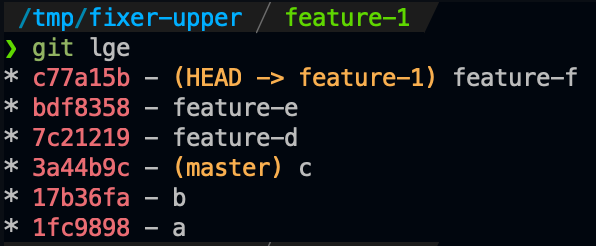
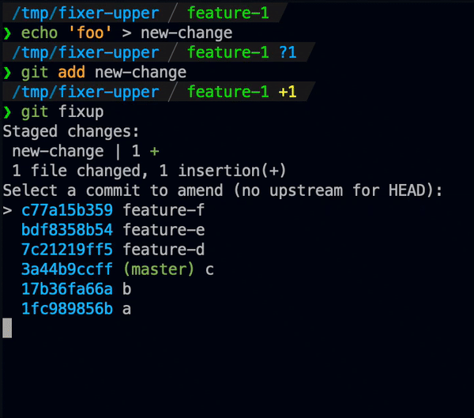
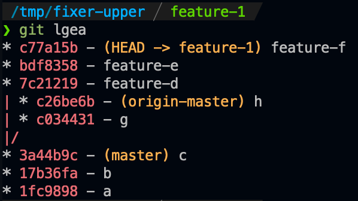
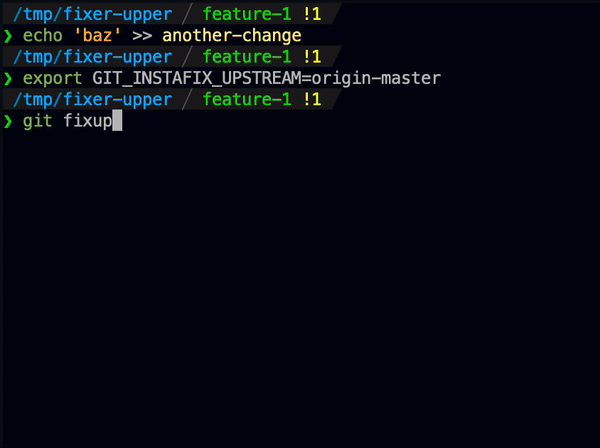

# git instafix

Quickly fix up an old commit using your currently-staged changes.

## Usage

After installation, just run `git instafix` to commit your currently-staged
changes to an older commit in your branch.

By default, `git instafix` checks for staged changes and offers to amend an old
commit.

Given a repo that looks like:

Running `git instafix` will allow you to edit an old commit:

The default behavior will check if your current HEAD commit has an `upstream`
branch and show you only the commits between where you currently are and that
commit. If there is no upstream for HEAD you will see the behavior above.

If you're using a pull-request workflow (e.g. github) you will often have repos that look more like this:

You can set `GIT_INSTAFIX_UPSTREAM` to a branch name and `git instafix` will only
show changes between HEAD and the merge-base:

In general this is just what you want, since you probably shouldn't be editing
commits that other people are working off of.

After you select the commit to edit, `git instafix` will apply your staged changes
to that commit without any further prompting or work from you.

Adding the `--squash` flag will behave the same, but after you have selected the commit amend to
git will give you a chance to edit the commit message before changing the tree at that point.

## Installation

You can install the latest version with curl:

    curl --proto '=https' --tlsv1.2 -LsSf https://github.com/quodlibetor/git-instafix/releases/latest/download/git-instafix-installer.sh | sh

If you have Homebrew (including linuxbrew) you can install it with:

    brew install quodlibetor/git-tools/git-instafix

You can also install from this repo with `cargo`:

    cargo install --git https://github.com/quodlibetor/git-instafix

Otherwise, you will need to compile with Rust. Install rust, clone this repo,
build, and then copy the binary into your bin dir:

    curl https://sh.rustup.rs -sSf | sh
    git clone https://github.com/quodlibetor/git-instafix && cd git-instafix
    cargo build --release
    cp target/release/git-instafix /usr/local/bin/git-instafix

## Similar or related projects

* [`git-absorb`](https://github.com/tummychow/git-absorb) is a fantastic tool that will
  automatically determine which commits to amend. It is reliable, the main downside to it is that
  it relies on a diff intersection between your changes and ancestor commits, and so sometimes
  cannot determine which commits to amend.
* [`git-fixup`](https://github.com/keis/git-fixup) is more-or less a pure-shell version of this
  same tool. We have some different features. The big differences between `git-fixup` and
  `git-instafix` are pretty much all surface level, and `git-instafix` is written in Rust which
  allows for some slightly fancier interactions. `git-instafix` does not depend
  on the system it's being run on having a git binary, instead using libgit2 for
  all git interactions.

## License

git-instafix is licensed under either of

 * Apache License, Version 2.0, ([LICENSE-APACHE](LICENSE-APACHE) or
   http://www.apache.org/licenses/LICENSE-2.0)
 * MIT license ([LICENSE-MIT](LICENSE-MIT) or
   http://opensource.org/licenses/MIT)

at your option.

Patches and bug reports welcome!
