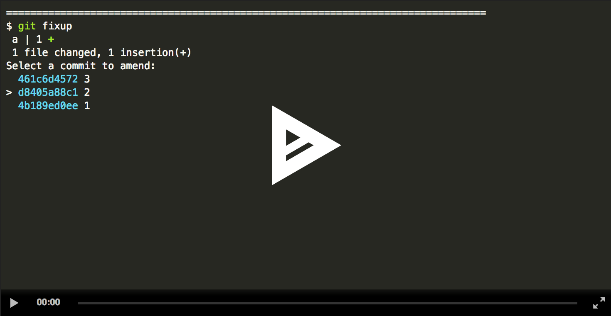

# git fixup

Quickly fix up an old commit using your currently-staged changes.

## Usage

After installation, just run `git fixup` or `git squash` to perform the related
actions.

Running `git fixup` will check if you have any staged changes (if not it will
prompt you to stage all changes) and then present you with a list of commits
from your current work point (HEAD) to HEAD's upstream. For example, if you are
on `master` and its is `origin/master`, `git fixup` will show all commits
between `master` and `origin/master`. In general this is just what you want,
since you probably shouldn't be editing commits that other people are working
off of.

After you select the commit to edit, `git fixup` will apply your staged changes
to that commit without any further prompting or work from you.

`git-squash` is just a symlink to `git-fixup` installed by brew, but if you
invoke it (either as `git-squash` or `git squash`) it will behave the same,
asking you which change to amend, but after you have selected the commit to git
will give you a chance to edit the commit message before changing the tree at
that point.

## Installation

If you're on macos or linux and using homebrew you should be able to do:

    brew install quodlibetor/git-fixup/git-fixup

Otherwise, you will need to compile with Rust. Install rust, clone this repo,
build, and then copy the binary into your bin dir:

    curl https://sh.rustup.rs -sSf | sh
    git clone https://github.com/quodlibetor/git-fixup && cd git-fixup
    cargo build --release
    cp target/release/git-fixup /usr/local/bin/git-fixup

## License

git-fixup is licensed under either of

 * Apache License, Version 2.0, ([LICENSE-APACHE](LICENSE-APACHE) or
   http://www.apache.org/licenses/LICENSE-2.0)
 * MIT license ([LICENSE-MIT](LICENSE-MIT) or
   http://opensource.org/licenses/MIT)

at your option.

Patches and bug reports welcome!
